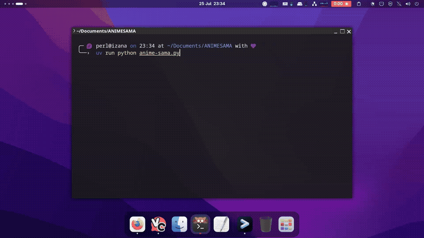

<div align="center">

# animesama-cli

Browse and watch anime from [anime-sama.fr](https://anime-sama.fr) directly in your terminal.

<a href="https://aur.archlinux.org/packages/animesama-cli"></a>


</div>

## Demo

<div align="center">



</div>

## Overview

animesama-cli is a terminal application for browsing and watching anime from [anime-sama.fr](https://anime-sama.fr). It provides catalog search, persistent watch history, and the weekly release schedule. Video playback is handled by [mpv](https://mpv.io).

## Features

- Full-text search of the anime-sama.fr catalog
- Interactive TUI built with [Textual](https://textual.textualize.io/), with a standard CLI fallback
- Watch history stored in SQLite, with resume support
- Weekly release schedule from anime-sama.fr
- Upcoming episodes from animecountdown.com
- French dub (VF) and Japanese audio with French subtitles (VOSTFR)
- Linux and Windows support; AUR package available for Arch Linux

## Installation

### Linux

Debian / Ubuntu: requires `curl`, `python3` and `mpv`. The script installs everything else.

```sh
sudo apt-get install curl -y
curl -fsSL https://raw.githubusercontent.com/Miro-sh/animesama-cli/master/install_unix.sh -o /tmp/animesama-install.sh && chmod +x /tmp/animesama-install.sh && sh /tmp/animesama-install.sh
```

Arch Linux:

```sh
yay -S animesama-cli
```

### Windows

Run the following command in PowerShell (no administrator rights required):

```powershell
irm "https://raw.githubusercontent.com/Miro-sh/animesama-cli/refs/heads/master/install_windows.bat" -OutFile install.bat; .\install.bat
```

The script installs the Python dependencies, downloads mpv, and creates the launcher scripts. Restart your terminal after installation, then run `animesama-cli`.

## Usage

| Command | Description |
|---------|-------------|
| `animesama-cli` | Launch the TUI (falls back to CLI if Textual is not installed) |
| `animesama-cli --cli` | Force CLI mode |
| `animesama-cli naruto` | Search directly |
| `animesama-cli --vf naruto` | Search French dub only |
| `animesama-cli -c` | Show watch history |
| `animesama-cli -cf` | History with last-episode check |
| `animesama-cli -p` | Weekly schedule |
| `animesama-cli -up` | Upcoming episodes |
| `animesama-cli --debug naruto` | Search with debug output |
| `animesama-cli -h` | Show all options |

The watch history is stored at `~/.local/share/animesama-cli/history.db` and can be opened with any SQLite browser.

## Uninstall

<details>

**AUR:**

```sh
yay -R animesama-cli
```

**Linux (manual install):**

```sh
sudo rm /usr/local/bin/animesama-cli
rm -rf ~/animesama-cli
rm -rf ~/.local/share/animesama-venv
```

**Windows:**

```batch
@echo off
set "INSTALL_DIR=%USERPROFILE%\AnimeSamaCLI"

if exist "%USERPROFILE%\mpv.bat" del /q "%USERPROFILE%\mpv.bat"
if exist "%USERPROFILE%\animesama-cli.bat" del /q "%USERPROFILE%\animesama-cli.bat"
if exist "%WINDIR%\mpv.bat" del /q "%WINDIR%\mpv.bat" 2>nul
if exist "%WINDIR%\animesama-cli.bat" del /q "%WINDIR%\animesama-cli.bat" 2>nul

rd /s /q "%INSTALL_DIR%" 2>nul

for /f "tokens=2*" %%A in ('reg query "HKCU\Environment" /v PATH 2^>nul') do set "OLD_PATH=%%B"
setlocal enabledelayedexpansion
set "NEW_PATH=!OLD_PATH!"
set "NEW_PATH=!NEW_PATH:;%INSTALL_DIR%\mpv=!"
set "NEW_PATH=!NEW_PATH:;%INSTALL_DIR%=!"
set "NEW_PATH=!NEW_PATH:%INSTALL_DIR%\mpv;=!"
set "NEW_PATH=!NEW_PATH:%INSTALL_DIR%;=!"
set "NEW_PATH=!NEW_PATH:%INSTALL_DIR%\mpv=!"
set "NEW_PATH=!NEW_PATH:%INSTALL_DIR%=!"
setx PATH "!NEW_PATH!"
endlocal
```

</details>

## Dependencies

| Category | Packages |
|----------|----------|
| Python   | `requests`, `beautifulsoup4`, `textual` (optional, for the TUI), `windows-curses` (Windows only) |
| System   | `mpv`, `git`, `python3` |

Built-in Python modules used: `sqlite3`, `re`, `json`, `sys`, `os`, `time`, `datetime`, `locale`, `pathlib`, `subprocess`, `asyncio`.

## FAQ

<details>
  <summary>Click to expand</summary>
  <br>

**Can I change or disable subtitles?** No. Subtitles are embedded in the video stream.

**Can I watch in French?** Yes. Use `--vf` when searching.

**Can I switch the audio language?** No. The site only provides French dub and Japanese audio with French subtitles.

**Can I use a different video source?** No, unless you write your own scraper.

**Can I use VLC?** No. Only `mpv` is supported.

**Where can I find all the options?** Run `animesama-cli --help`.

</details>

## Related projects

- [ani-cli](https://github.com/pystardust/ani-cli): Japanese audio, English subtitles (4anime, gogoanime, allmanga). animesama-cli was inspired by this project.
- [GoAnime](https://github.com/alvarorichard/GoAnime): Japanese audio, Portuguese subtitles
- [doccli](https://github.com/TowarzyszFatCat/doccli): Japanese audio, Polish subtitles (docchi.pl)

## Contributing

Contributions are welcome. Please read [CONTRIBUTING.md](./contribution.md) before opening an issue or pull request. You can also join the [Discord server](https://discord.gg/MwHAXPpJ8C) to discuss the project.

## Disclaimer

This project only fetches publicly available content and hosts nothing itself. Users are responsible for how they use it. See [DISCLAIMER.md](./disclaimer.md) for details.
